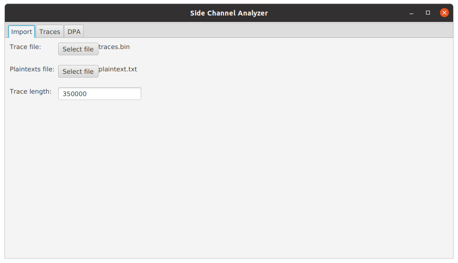
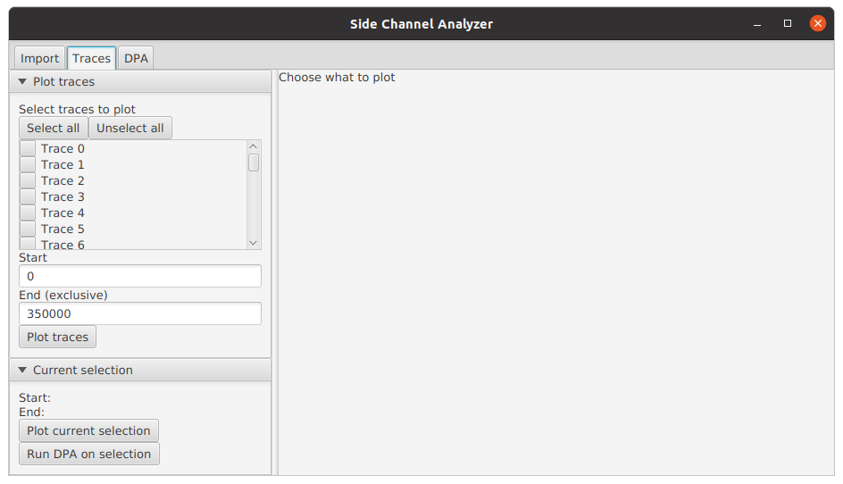
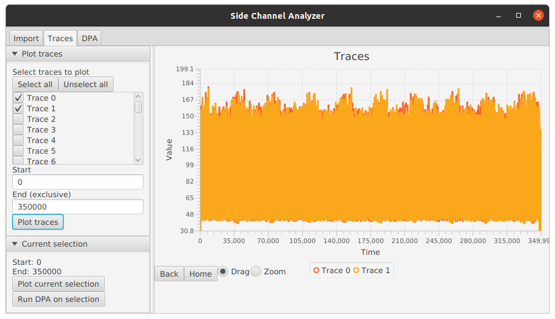
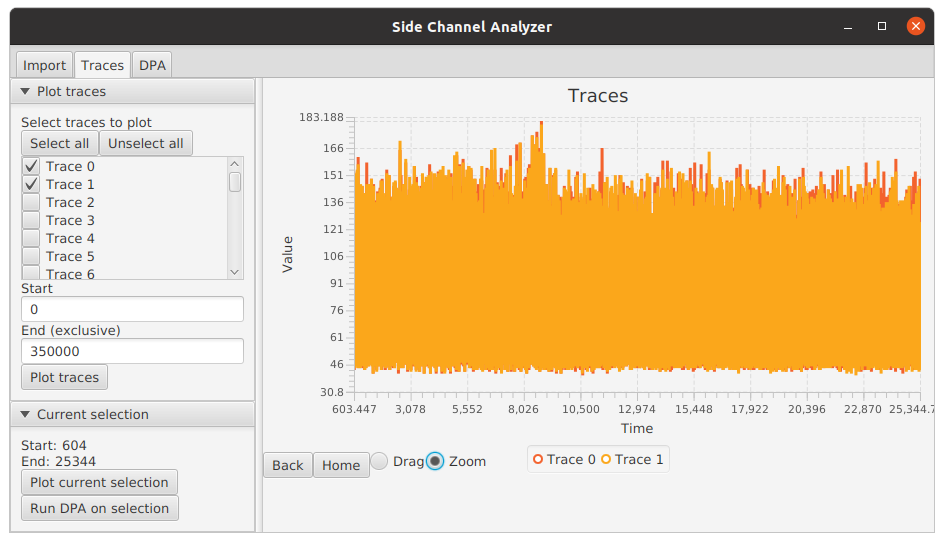
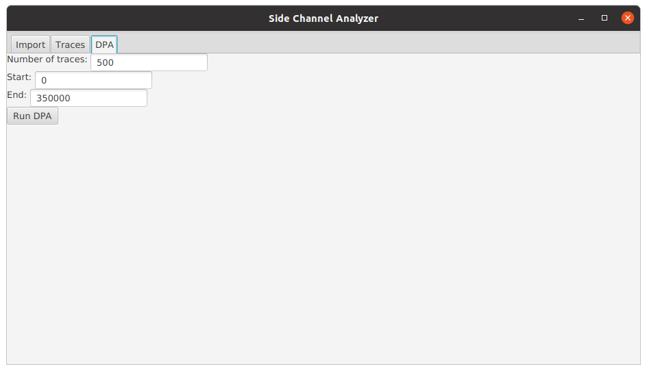
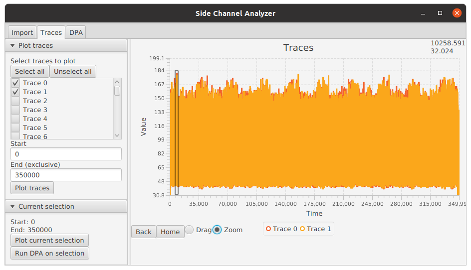
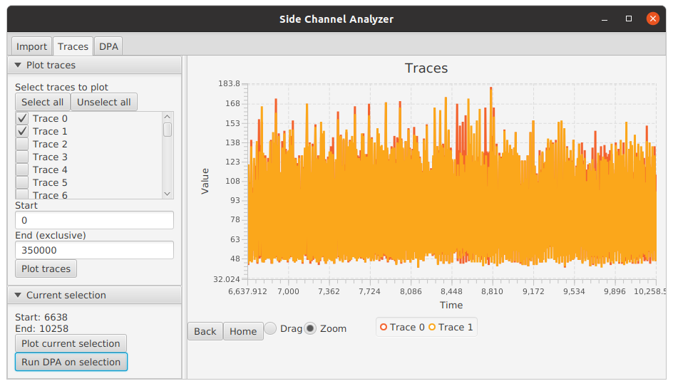
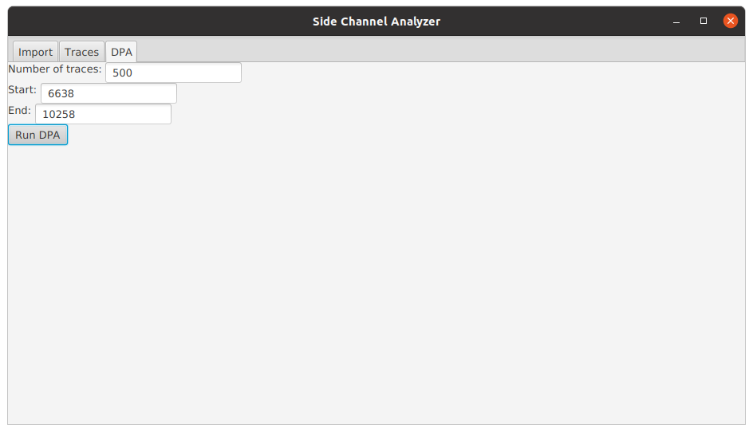
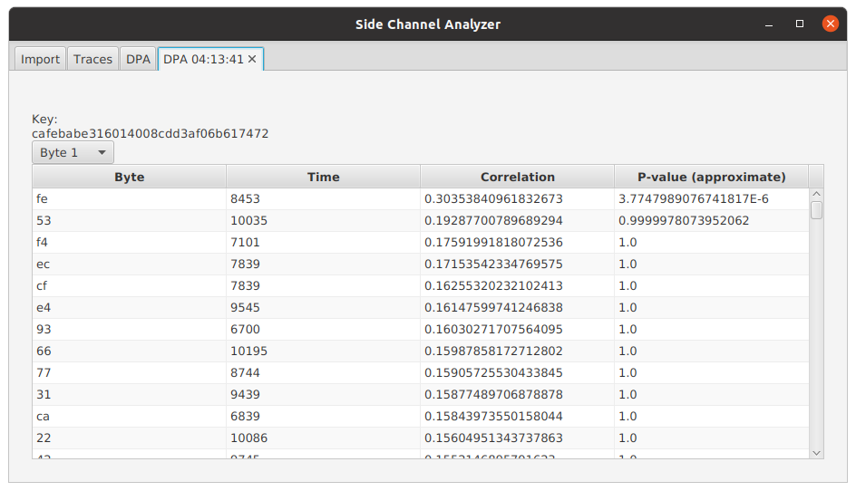

# side-channel-analyzer

Side-Channel Trace Analyzer Tool


## Description

Side-Channel Analyzer is a desktop application for analyzing side-channel traces of encryption algorithms. It is
specifically designed for performing Differential Power Analysis on AES power traces. Other features may be added in the
future.


## Project Info

- Issue tracking: https://github.com/tmtemetm/side-channel-analyzer/issues
- External Dependencies:
    - Java 11 or higher


## Local Development Setup

- Install OpenJDK 11 or higher
- Clone this Git repository
```
git clone git@github.com:tmtemetm/side-channel-analyzer.git
```
- Build the package using either the provided maven wrappers or with a local maven installation:

On Unix:
```
./mvnw clean package
```
Or on Windows:
```
mvnw.cmd clean package
```
- Run the application with
```
./mvnw spring-boot:run
```
or, if you prefer,
```
java -jar target/side-channel-analyzer-1.0.0-RELEASE.jar
```

## Operating Principle and Examples

Differential Power Analysis is a side-channel attack, which means that it makes use of information exchange with the
cryptographic module that is not part of its intended function. It is based on the observation that the power
consumption of a computing unit is dependent on the data it processes. The dependence can arise, for example, from power
leakages of semiconductor chips during logic transitions.

In contrast to simple power analysis, differential power analysis measures the power consumption of a cryptographic
module during multiple runs of the cryptographic operation and analyzes these power traces statistically. One way of
statistically analyzing the power traces is to correlate the power traces at a specific time instant to a hypothesized
power model.

Below, we go through the operating principle of the DPA implementation with an example measurement.

### Measurement Setup and Trace Data

We use an example measurement of an externally powered chip performing 128-bit AES. The chip was connected to a computer
that sent encryption instructions with randomly selected 128-bit plaintexts to the chip. The power consumption of the
chip was measured with an oscilloscope.

Example measurement traces and plaintexts can be found
[here](https://github.com/tmtemetm/side-channel-analyzer/releases/download/1.0.0-RELEASE/examples.zip).

### Importing Traces in Side-Channel Analyzer

The Side-Channel Analyzer tool currently expects the import file to contain the traces in binary format as 8-bit
unsigned integers with no separators between the traces, though additional formats may be supported in the future.
The tool also expects a file containing the plaintexts used for encryption with each plaintext on its own line
and whitespace separating the individual bytes in hexadecimal. The trace length is primarily inferred from the length of
the trace file and the number of plaintexts. If unsuccessful, it has to be input by the user.



### Plotting Traces in Side-Channel Analyzer

After the traces and plaintexts have been imported, the user can plot the traces under the `Traces` tab. The figure
figure shows the initial view of the traces tab.



On the left, the user can select which traces to plot and the starting and ending points for plotting. As an example,
the figure below shows the plot of the first two traces (Choose `Trace 0` and `Trace 1` and press `Plot traces`). We can
immediately notice 10 bumps of larger power consumption, which correspond to the 10 rounds of 128-bit AES.



The traces can be examined using the drag and zoom functionalities by dragging over the image. The tool in use can be
changed using the radio buttons below the plot area. The `Back` and `Home` buttons allow reverting to previous views
or to the first view. Below we have zoomed over the first AES round.



Plotting a large amount of full traces is not recommended, since the full traces consume a lot of memory. If one wishes
to view a large amount of traces at once, they should be plotted only within a small interval using the `Start` and
`End` inputs.

### Performing Differential Power Analysis

Differential power analysis can be started from the `DPA` tab. The user can input the number of traces to include in the
analysis and the starting and ending points of the time interval to consider for the analysis. Alternatively, the user
can set the interval to the currently plotted interval by pressing `Run DPA on selection` under the `Traces` tab. The
interval should not be set too long (tens of thousands), since the analysis is quite computationally expensive.



To perform the DPA, press `Run DPA`. This will open a new tab for inspecting the results. Let's see how's the analysis
conducted.

### Description of the Algorithm

As mentioned above, differential power analysis analyzes the power traces of multiple runs of a cryptographic operation
statistically. The algorithm in Side-Chanel Analyzer uses a hypothesized power model and correlates it with the observed
power consumptions across traces.

#### The Power Model

The algorithm targets the individual bytes in the output of the first SubBytes step. The step is preceded by the
AddRoundKey step, where the plaintext is XOR-ed with the first round key. Then, the individual bytes are transformed
with a so-called S-Box, which performs a non-linear transformation on the bytes.

The value after the first SubBytes is a good candidate for power analysis. Since the S-Box is often implemented as a
look-up table, the value is read from memory and with some hardware implementations, the power consumption of reading
from memory is largely dependent on the Hamming weight (number of set bits) of the returned value. Additionally, the
operation following SubBytes is ShiftRows, which shifts the byte within the block but leaves the byte in tact before
passing it to the next step, the MixColumns step.

The bytes after the first SubBytes operation are also easy to model, since they are only affected by a single byte of
the round key. Each byte in the output of the SubBytes operation can be calculated by XOR-ing the corresponding byte of
the plaintext with the corresponding byte of the round key and passing that value through the S-Box. This implies that
the DPA can be performed on individual bytes separately, instead of having to consider the whole round key. Roughly,
this means that the complexity of the analysis is reduced from 2<sup>128</sup> to 2<sup>8</sup>, although in practice it
is not quite that simple.

Based on the above discussion, the Hamming weight of the output value of the first SubBytes operation is a good
candidate for a power model. In practice, the algorithm
- considers each byte position in the round key separately,
- iterates through all the 2<sup>8</sup> possible bytes for that position,
- XOR-s the key with the corresponding plaintext position,
- looks up the S-Box value for the XOR-ed value,
- hypothesizes the power consumption by computing the Hamming weight of the S-Box output, and
- correlates the hypothesized power consumptions with the measured ones across multiple traces.

The last phase is discussed in more detail in the next section. Other power models are also possible, but the Hamming
weight of the first SubBytes output seems to work well in practice. Other power models may be added to Side-Channel
Analyzer in the future.

#### Correlating the Hypothesized and Measured Power Consumptions

Suppose for now that we know the correct time instant _t_ where the modeled value (e.g., the output of the first
SubBytes step) is processed. The distribution of power consumptions at time _t_ across traces should follow
approximately the hypothesized power consumptions calculated using the power model and the currently considered byte
position, if the key byte was correctly hypothesized. Of course there will be extra noise, notably from the remaining 15
byte positions that are not being considered.

On the other hand, if the hypothesized key byte is wrong, the hypothesized power consumptions should not correlate with
the measured ones if the hypothesized key byte is wrong, since the power hypothesis (e.g., the hamming weight of
the SubBytes output) will also be wrong. To find out the correct key byte, we can therefore iterate through all
2<sup>8</sup> possible key bytes and correlate the hypothesized power consumptions with the measured ones at time _t_.
The correct key byte should be the one with the highest correlation.

Since in reality, we don't know the correct time instant _t_, we'll also need to iterate through a time interval
_t<sub>1</sub>,...,t<sub>l</sub>_, correlate all key-time pairs and choose the key byte and time instant with the
highest correlation. For computing the correlations, we use the Pearson's correlation coefficient due to its simplicity.

The algorithm has to compute 2<sup>8</sup>_l_ correlations for all byte positions, where _l_ is the length of the time
interval. Choosing a wider time interval increases the possibility of finding the correct time instant but increases the
running time of the algorithm.

#### An Example in Side-Channel Analyzer

We will run an example DPA using the Side-Channel Analyzer tool. From the plot of the first two traces below, we can
recognize the 10 rounds of a 128-bit AES.


We also notice a large spike in power consumption that is present in many of
the other rounds as well. Hoping that the modeled intermediate value is processed somewhere around that spike, we zoom
in around that spike.



We then send the currently shown interval to the DPA feature by pressing `Run DPA on selection`.



We leave the settings as they are and press `Run DPA`.



This will open a new tab with the results. The tool analyzes the bytes in parallel and updates the results as they
finish.


The key string presents the completed key bytes in hexadecimal and `??` for uncompleted bytes. The presented string is
the round key, but conveniently for the first AddRoundKey operation, the round key equals the encryption key.

Individual bytes can be examined by selecting the desired byte position from the choose box. The table lists the byte
value hypotheses with the best result first. For each hypothesis, the table presents the time instant with the highest
correlation, the correlation between the hypothesized and measured power consumptions at that instant, and an
approximate p-value for the correlation.



The p-value provides a good way for interpreting whether the found key byte is likely to be correct or not. The p-value
tells the probability of obtaining the observed correlation if no correlation is assumed. A p-value of 0.05 therefore
implies that there is a 5 % probability of making the wrong conclusion if we conclude that the hypothesized and
measured power consumptions are correlated. Therefore, a p-value of 0.05 in the output of the algorithm tells us that
there's a 5 % probability of picking the wrong key byte. The p-values output by the algorithm should be considered
approximate, since the underlying assumptions behind the computation of the p-value are not necessarily fully met.
Nevertheless, the p-values provide a good tool for approving or rejecting the output of the algorithm. The lower the
p-value, the better the result.
